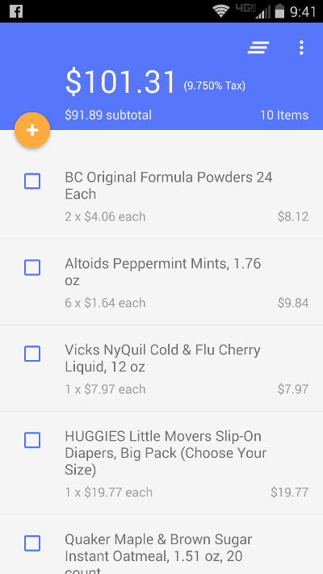

# Walmart Buddy

A shopping list application which allows Walmart shoppers to scan items while they shop and provides a rough estimate of how much money expected to spend. This app can be found in the [Google Play Store](https://play.google.com/store/apps/details?id=com.donellesandersjr.walmartbuddy)

## Why another shopping list app?

I created this app to experiment with and learn how to implement [Material Design](http://www.google.com/design/spec/material-design/introduction.html) and also save a few bucks ;-). 

## LICENSE

In summary, Have Fun & Share! For specifics see [link](LICENSE)

## Questions?

If you have any questions or comments about the tutorial please feel free to drop me a line :-).

Email: <donelle@donellesandersjr.com>
Follow Me: [@DonelleJr](https://twitter.com/DonelleJr)